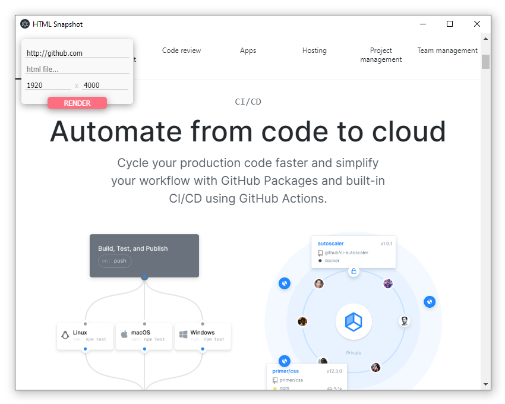

# HTML Snapshot
> Small utility to render the snapshot of a HTML document to a file.

Rendering a HTML page to an image file in a certain dimension enables web-layouts to be utilized for the design of documents. It paves the way for graphical content generated from web code that appearance is detached from any browser reliance after being exported.

A screenshot of the app giving a preview of the only interface:



## Build instructions

The project requires an installation of [Node.js](https://nodejs.org) including its own package management system to satisfy all further dependencies. Those modules listed in the _packages.json_ are obtained automatically by executing the following line in the working tree root directory:

```sh
npm install
```

Following that you can run the program from source by executing:

```sh
npm start
```

And you can also use the next line to package the program as a self-containing executable:

```sh
npm run dist
```

## Main features

#### Up-to-date rendering engine

With the application being build on Electron 8.0.1 the given HTML code is rendered with __Chromium 80.0.3987.86__, the engine utilized for Google Chrome 80.

#### Convenient debugging features

The application adopts the debugging features provided by Chromium and makes them accessible by the default keyboard shortcut [Ctrl+Shift+I]. You can therefor change the layout details of the page dynamically before taking the snapshot.

## Third Party

* __Node.js__: Node.js JavaScript runtime (https://nodejs.org)

Obtained through Node.js package management (NPM):

* __Electron__: Build cross platform desktop apps with JavaScript, HTML, and CSS (https://www.npmjs.com/package/electron)

* __electron-builder__: A complete solution to package and build a ready for distribution Electron app for MacOS, Windows and Linux with “auto update” support out of the box (https://www.npmjs.com/package/electron-builder)

* __electron-localshortcut__: Register/unregister a keyboard shortcut locally to a BrowserWindow instance, without using a Menu (https://www.npmjs.com/package/electron-localshortcut)

* __ESLint__: An AST-based pattern checker for JavaScript (https://www.npmjs.com/package/eslint)

* __eslint-config-google__: ESLint shareable config for the Google style (https://www.npmjs.com/package/eslint-config-google)

* __jQuery__: JavaScript library for DOM operations (https://www.npmjs.com/package/jquery)

## Contribution

1. Fork it (<https://github.com/rzllmr/html-snapshot/fork>)
2. Create your feature branch (`git checkout -b feature/example`)
3. Commit your changes (`git commit -am 'Change something'`)
4. Push to the branch (`git push origin feature/example`)
5. Create a new Pull Request

## License

Licensed under the [MIT license](https://github.com/rzllmr/html-snapshot/blob/master/LICENSE).
